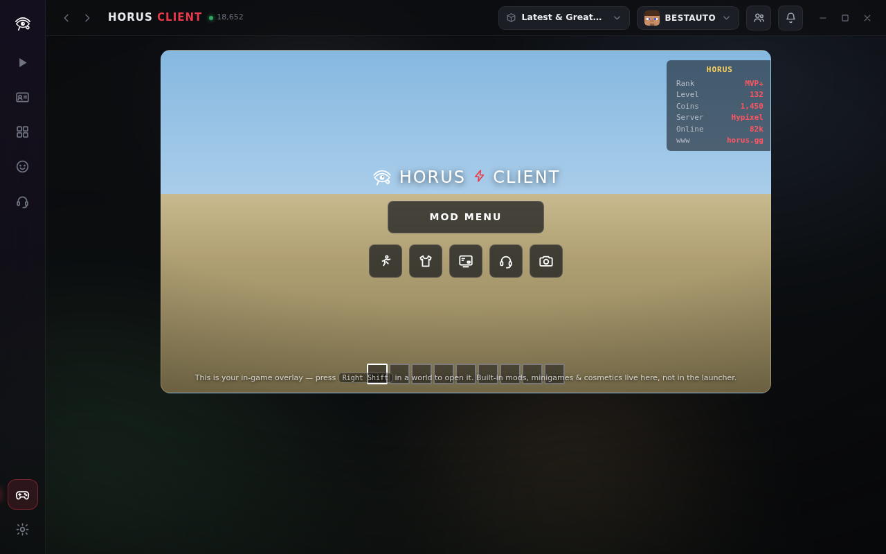
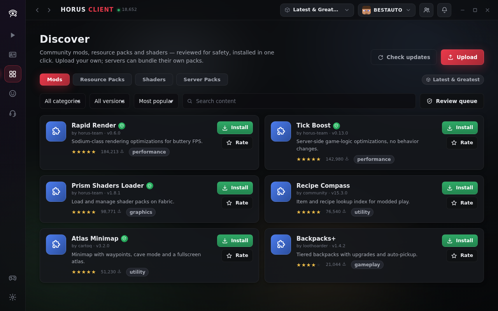
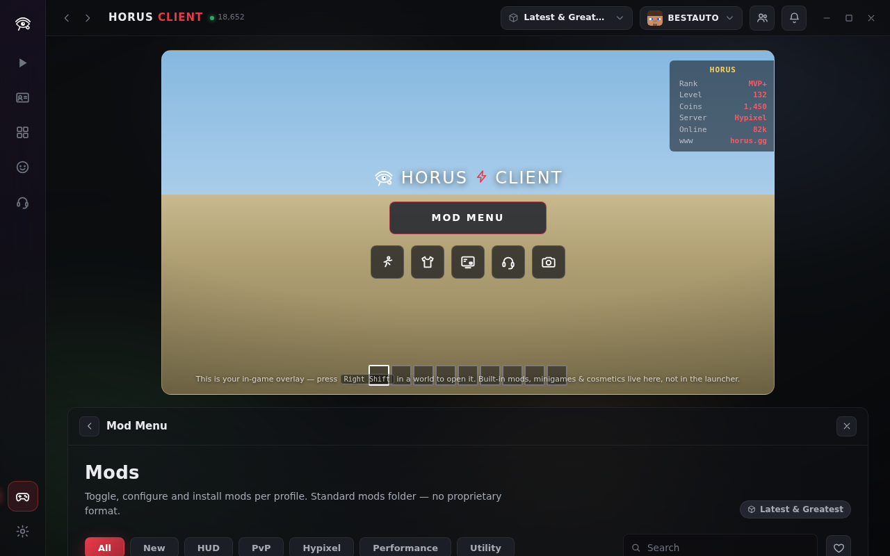

<div align="center">

# 𓂀 Horus Client

**Der offene Minecraft-Client-Launcher.**
Ein Client im NoRisk-/Feather-Stil, neu gebaut als freie Software — mit wegdesignten Paywalls.

MIT-Lizenz · null Abhängigkeiten · keine Telemetrie · kein Echtgeld-Store · kein Account-Zwang

[English 🇬🇧](README.md) · [Schnellstart](#schnellstart-windows) · [Features](#alles-drin) · [Architektur](#architektur)


</div>

---

## Der Launcher startet das Spiel — der Rest ist im Spiel

Horus zieht eine klare Grenze, genau wie NoRisk:

- **Der Launcher** ist eine schmale Icon-Leiste + ein Startbildschirm mit deinem 3D-Skin und einem großen **LAUNCH**-Button. Seine Aufgaben: **Instanz** wählen, **Cosmetics** verwalten, **Inhalte pro Instanz** hinzufügen (Mods/Packs/Shader von Modrinth & CurseForge) und **Social**.
- **In Minecraft** öffnet **Rechte Umschalttaste** das In-Game-Overlay: das **MOD MENU** (alle eingebauten Client-Mods — hier eingestellt, nie im Launcher), **Minispiele**, Cosmetics-Schnellwechsel, HUD-Editor, Social und Screenshots.

<div align="center">
 
 
</div>

## Alles drin

| | |
|---|---|
| 🎬 **NoRisk-Style-Launcher** | Schmale Icon-Leiste, Topbar mit Instanz + Account + Freunden, zentraler 3D-Skin, großer LAUNCH-Button mit Versionsauswahl, Live-NEWS-Panel. |
| 🧥 **Alle Vanilla-Capes 1:1** | **Alle** offiziellen Minecraft-Capes — Migrator, Cherry Blossom, 15th Anniversary, jedes MineCon, Vanilla, Mojang (Studios + Classic), Realms, Translator, Cobalt, Scrolls, Prismarine, Turtle, Founder's, Purple Heart, Common/Home/Menace, Snowman, Spade, Birthday u. v. m. — als scharfe Pixel-Art, plus Community-Capes. Browser mit **All / My Capes / Favorites / Vanilla**, Suche, Favoriten und Live-3D-Vorschau. |
| 🎨 **Cape-Studio** | Eigene Capes **gratis** gestalten: 10×16-Pixel-Editor mit Füllen/Spiegeln, PNG-Import/-Export, Start von jedem Vanilla-Cape als Vorlage. |
| 📦 **Inhalte pro Instanz** | Mods, Resource Packs und Shader **pro Instanz** aus **Modrinth** und **CurseForge** hinzufügen, Ein-Klick-Installation, Verifiziert-Badges, Bewertungen, Auto-Updates. **Benötigte Abhängigkeiten werden automatisch mitinstalliert**, und *Updates prüfen* findet neuere Builds installierter Jars per SHA-1. |
| 🧰 **Empfohlenes Paket** | Die NoRisk-artige vorkonfigurierte Sammlung — Sodium, Lithium, FerriteCore, ModernFix, Entity Culling, Krypton, Iris, Indium, Continuity, Zoomify, Mod Menu, AppleSkin, EMI u. v. m. — mit einem Klick als normale Jars installiert (Mods → Empfohlen). |
| 🎛️ **Shader- & Resourcepack-Verwaltung** | shaderpacks/ und resourcepacks/ pro Instanz: aktivieren/deaktivieren, löschen, **Prioritäts-Reihenfolge landet in der echten options.txt**, Installation von Modrinth nach Typ. |
| 🌐 **Server-Seite** | Server speichern, Favoriten, Live-Status/Ping/Spielerzahl, Ein-Klick-**Beitreten** (startet die aktive Instanz direkt auf den Server via `--server`/QuickPlay) und Direktverbindung. |
| 🖥️ **Video-Einstellungen, die im Spiel ankommen** | Sicht-/Simulationsweite, GUI-Skalierung, Helligkeit, Maus-Empfindlichkeit, Lautstärke — beim Start in die options.txt der Instanz geschrieben; „leave“-Werte fassen In-Game-Einstellungen nie an. |
| 👥 **Mehrere Accounts** | Offline- + Microsoft-Accounts speichern und mit zwei Klicks wechseln (Einstellungen → Konto); MSA-Logins werden automatisch übernommen. |
| 🧯 **Logs, Crash-Reports & Reparatur** | Session-Log-Viewer, automatische Crash-Report-Dateien bei Absturz, und *Prüfen & Reparieren* verifiziert jede Spieldatei per SHA-1 — ohne das Spiel zu starten. |
| 🚀 **Horus Core** | Hardware- und versionsabhängiges JVM-Tuning (Aikar-Klasse G1, Low-End-Pausenziele) und ein **Verified-File-Cache**: einmal geprüfte Dateien werden per Größe+mtime erinnert — Wiederholungs-Starts hashen nicht erneut hunderte MB. Sekunden statt zig Sekunden auf HDD-Rechnern. |
| 🩺 **Horus Assistent** | Regelbasierter Doctor: RAM-Check gegen die echte Hardware, Java-Eignung, doppelte & konfliktierende Jars (OptiFine+Sodium…), Crash-Log-Erklärungen — jeder Befund mit Ein-Klick-Fix. Keine Cloud, kein LLM, jede Regel nachprüfbar. |
| 🏗️ **Building & Schematics** | Echter NBT-Parser liest .schem/.schematic: Maße, Blockzahl und die komplette **Materialliste** (mit Stacks) direkt aus der Datei. Ghost-Blocks-/Baufortschritt-/Material-Tracker-Module. |
| 🏆 **Fortschritt** | XP, Level, 15 Achievements mit Live-Zählern (Starts, Spielzeit, Mods, Capes, Minispiele…) — alles erspielt; Badges zahlen XP und Coins in dieselbe offene Economy. |
| 🎯 **Practice-Tools** | Aim Trainer (30 s, schrumpfende Ziele, Accuracy-Wertung) und CPS-Test — echte Warmup-Tools auf der Minispiele-Seite. |
| 🪄 **Ein-Klick-Setup** | Der erste Start fragt „Was spielst du?" — PvP / Survival / Building / Skyblock / Modded konfiguriert Module, HUD und Performance mit einem Klick und speichert es als Preset. Nie ein Lock-in. |
| ☁️ **Setup-Sync** | Das komplette Setup (Einstellungen, Instanzen, Module, HUD, Tasten, Cosmetics, Fortschritt) als eine Datei exportieren und auf jedem PC wiederherstellen. |
| 🖼️ **Screenshot-Editor & Replays** | Blur-/Pixelate-Werkzeug (speichert eine bearbeitete Kopie), Löschen aus der Galerie, und ein Replay-Browser für echte Replay-Mod-.mcpr-Aufnahmen. |
| 🛡️ **Upload-Sicherheitsscan** | Jeder Registry-Upload wird zip-inspiziert (native Binaries, Skripte, Pfad-Ausbrüche) und zeigt dem Reviewer ein Risiko-Urteil — ein Stolperdraht für die menschliche Prüfung, ehrlich abgegrenzt. |
| 🏪 **Integrierte Content-Plattform** | Eigene Mods/Packs direkt im Launcher **hochladen** → **Admin-Review** → Verifiziert-Badge → Ein-Klick-Install für alle. **Server-Pakete** bündeln Mods + Einstellungen eines Servers hinter einem **Beitreten**-Button. |
| 🎮 **In-Game-Overlay** | Rechte Umschalttaste in der Welt → MOD MENU (40+ eingebaute Module), Minispiele (Tetris/Pong/Tic-Tac-Toe/Snake), HUD-Editor, Cosmetics, Social, Screenshot. |
| ⚡ **FPS-Boost-Regler** | Ein Regler, Off → Low → Medium → High → Extra → Extra High, unter Einstellungen → Leistung. Jede Stufe schaltet mehr eingebaute Module und HUD-Elemente ab — Extra ist als **nicht empfohlen** markiert (gerade so noch spielbar), bei Extra High bleibt nur noch der FPS-Zähler übrig. Nicht destruktiv: die eigenen An/Aus-Einstellungen kommen sofort zurück, sobald der Regler wieder heruntergestellt wird. |
| 💬 **Social überall** | Freundesanfragen, Status, Chats, Feed, Benachrichtigungen — im Launcher **und** im In-Game-Overlay. Optional & selbst hostbar. |
| 🪙 **Coins, Quests, Horus+** | Coins in der App verdienen (nie mit Geld) für Shop-Cosmetics; das NRC+-Tier wird **mit Coins** bezahlt. |
| ⬇️ **Echter Launcher-Kern** | Jede Minecraft-Version aus Mojangs offiziellen Metadaten, SHA-1-verifizierte Parallel-Downloads, **Fabric/Quilt**-Auto-Profile, Offline- + Microsoft-Device-Code-Login, **Bedrock**-Start unter Windows. |
| 🎨 **Themes & API** | Dark/Midnight/Sandstone/Light + Akzentfarbe; offene Server-Overlay-API ([docs/server-api.md](docs/server-api.md)). |

## Schnellstart (Windows)

Horus kommt als **echte, sich selbst installierende native Windows-App** —
`Horus.exe`: eigenes Fenster, eigenes Taskleisten-Icon, kein Browser-Tab,
kein Konsolenfenster. Doppelklick genügt — die App **installiert sich
selbst** wie jedes normale Windows-Programm (Eintrag im Startmenü,
Desktop-Icon, ein echter Deinstallieren-Eintrag unter Einstellungen → Apps)
und öffnet sich danach — kein separates Installationsprogramm, kein
„Ordner zusammenhalten", denn die komplette App steckt in dieser einen
Datei. Von da an verwaltet sie das abhängigkeitsfreie Node-Backend für dich
und startet damit **echte Minecraft-Instanzen** (echte
Mojang-Versions-Downloads, SHA-1-verifiziert, Fabric/Quilt,
Microsoft-Login — alles davon, keine Demo).

1. Node.js einmalig installieren: `winget install OpenJS.NodeJS.LTS` (und Java zum Spielen: `winget install EclipseAdoptium.Temurin.21.JRE`)
2. `Horus.exe` bauen (braucht [Go](https://go.dev/dl/), dauert Sekunden, funktioniert auch von Linux/macOS aus):
   ```bash
   git clone https://github.com/Han4Star2/MinecraftClient
   cd MinecraftClient/windows-app && ./build.sh
   ```
3. **Doppelklick auf `windows-app/dist/Horus.exe`** — sie installiert sich selbst, öffnet ein echtes Fenster, das Backend startet automatisch im Hintergrund.

Diese `Horus.exe` ist danach eigenständig: irgendwohin kopieren, an jemand
anderen weitergeben — sie braucht den Rest des Repositorys nicht daneben.
`Horus.bat` im Repo-Hauptverzeichnis ist eine leichtere Alternative, falls du
den Bau der nativen App überspringen willst (öffnet Horus in einem
App-Modus-Edge-Fenster mit demselben Backend). Siehe
[windows-app/README.md](windows-app/README.md) für die genaue
Funktionsweise der Selbstinstallation und warum Go+WebView2 statt Electron
oder einem klassischen Installer-Toolkit.

Kein `npm install`, kein Build-Schritt für den Launcher selbst — Horus hat **null Abhängigkeiten**.

<details>
<summary>Linux / macOS / manueller Start</summary>

```bash
git clone https://github.com/Han4Star2/MinecraftClient
cd MinecraftClient
npm start            # = node server/index.js → http://127.0.0.1:7411

node server/index.js --portable   # alle Daten in ./data
node server/index.js --data <dir> --port 7411 --no-open
```
</details>

```bash
npm test             # ZIP-Reader, Regel-Engine, API+Economy, Offline-Dry-Run-Launch (E2E)
npm run screenshots  # docs/screenshots per Headless-Chromium neu erzeugen
```

### Mit Microsoft anmelden

Einstellungen → Konto → Sitzungstyp `msa`. Horus implementiert den
Standard-Device-Code-Flow; als Open Source liefert es **keine eingebetteten
Geheimnisse** mit — du trägst einmalig eine Azure-*Anwendungs-ID (Client-ID)*
ein: [portal.azure.com](https://portal.azure.com) → App-Registrierungen → Neu →
Kontotyp „persönliche Microsoft-Konten“, *Öffentliche Clientflows zulassen*
aktivieren. Dauert ~3 Minuten, ist kostenlos, und das Token verlässt nie
deinen Rechner (`msa-session.json`, chmod 600). Der Offline-Modus funktioniert
ganz ohne.

### Mods

Profil wählen (z. B. Fabric + 1.21.5), **Mods → Mehr Mods holen** öffnen und
aus **Modrinth** (ohne Key) oder **CurseForge** (kostenloser Key in
Einstellungen → Netzwerk) installieren. Alles landet als normale Jars im
Standard-`mods/`-Ordner des Profils — `.jar` ⇄ `.jar.disabled`-Umschaltung,
Metadaten aus `fabric.mod.json`/`mcmod.info`. Forge-/NeoForge-Automatisierung
steht auf der Roadmap; bestehende Installationen funktionieren über das
gemeinsame Spielverzeichnis weiter.

### Bedrock

Profil mit Loader **Bedrock Edition** anlegen — der Start übergibt per
`minecraft://` an die Microsoft-Store-App (Windows). Das Umschalten zwischen
Bedrock-*Versionen* erfordert Appx-Sideloading, das Store-Apps einem Launcher
nicht sauber erlauben; kombiniere Horus dafür mit einem dedizierten
Version-Switcher — ehrlich dokumentiert statt halbgar.

## Die Coin-Economy (nirgendwo eine Kreditkarte)

```
Täglicher Check-in (Streak-Bonus) ─┐
Quests (täglich/wöchentlich/einmal)┼──► Coins ──► Shop-Artikel · Collections · Horus+
Minispiele (≤ 300/Tag)            ─┘
```

Preise, Quests und Drops sind offene Daten in
[`app/js/shopCatalog.js`](app/js/shopCatalog.js). Das Backend speichert die
Economy als JSON (`economy.json`) — dein Spielstand: sichern, editieren, er
gehört dir. Eigene Capes aus dem Studio sind immer gratis.

## NoRisk-/Feather-Features — und was Horus besser macht

| Anderswo | In Horus |
|---|---|
| Cosmetics kosten Echtgeld | Coins werden **nur in der App verdient** — im Code existiert kein Bezahlpfad |
| Premium kostet €/Monat | Horus+ kostet **Coins** und bietet sinngemäß dasselbe (Monats-Drops, Rabatte, größere Limits) |
| Proprietärer Client, geschlossenes Shop-Backend | MIT-lizenziert, local-first: Katalog, Economy und Cosmetics sind offene Daten auf deiner Platte |
| Cosmetics hängen an Account-Servern | Lokal gerendert; für alle Horus-Spieler sichtbar; eigene Capes als PNG exportierbar |
| Social-Ebene am Vendor-Backend | Heute local-first, offenes Protokoll + selbst hostbares Relay dokumentiert ([docs/server-api.md](docs/server-api.md)) |
| Electron-Klasse beim Ressourcenverbrauch | Abhängigkeitsfreier Node-Kern + Vanilla-JS-UI (~90 KB) im vorhandenen Webview |
| Account-Zwang | Offline-Sessions eingebaut; Microsoft-Login optional |
| Telemetrie | Keine. Es gibt keinen Analytics-Code zum Abschalten. |

## Architektur

```
┌──────────────────────────────────────────────────────────────┐
│  app/          Vanilla JS + CSS, kein Build-Schritt           │
│  ├─ pages/     Home News Bibliothek Mods HUD Shop Garderobe   │
│  │             Minispiele Social Welten Screenshots Settings  │
│  └─ js/        Router · i18n DE/EN · SSE-Client · Demo-Modus  │
│                Economy · 200+-Artikel-Katalog · CSS-3D-Player │
│                (Skins, Capes, Hüte, Wings, Pets, Nametags)    │
├────────────────────────── HTTP + SSE ────────────────────────┤
│  server/       Node ≥18, null npm-Abhängigkeiten              │
│  ├─ launcher   Regel-Engine · Args (modern+legacy) · Natives  │
│  │             Prozess-Supervisor · Bedrock-Übergabe          │
│  ├─ meta       Mojang-Manifest (gecacht, mirrorfähig) ·       │
│  │             Fabric/Quilt-Profil-Merge                      │
│  ├─ downloads  Parallel-Queue · SHA-1-Verify · Resume-Skip    │
│  ├─ zip        minimaler Reader (Natives, Mod-Metadaten)      │
│  ├─ net        Redirects · Timeouts · CONNECT-Proxy           │
│  ├─ msa        Device-Code-Kette (MSA→XBL→XSTS→MC)            │
│  ├─ ping       Server List Ping (Live-Status der News-Seite)  │
│  ├─ modrinth / curseforge   zwei Mod-Quellen, normale Jars    │
│  └─ store      Settings/Profile/Economy als offenes JSON      │
└──────────────────────────────────────────────────────────────┘
```

Daten liegen in `~/.horus` (oder `./data` mit `--portable`): offenes JSON für
Settings, Profile und Economy; geteilte hash-verifizierte `libraries/`,
`versions/`, `assets/`; isolierte Spielverzeichnisse pro Profil. Bereits
genutzte Versionen starten offline aus dem Cache; die mitgelieferte
Fallback-Versionsliste ist klar markiert und erfindet nie Hashes.

## Tests

`npm test` (abhängigkeitsfreies `node:test`): ZIP-Round-Trip gegen einen
unabhängigen Writer inkl. Zip-Slip-Schutz · Regel-Engine · Maven-Mapping ·
Loader-Merge · Offline-UUID · API-Smoke-Test inkl. **Economy-Persistenz** ·
kompletter **Dry-Run-Launch** gegen einen lokalen Fixture-Meta-Server,
Ende-zu-Ende hash-verifiziert. Die UI wird zusätzlich von einer
Playwright-Interaktionssuite abgedeckt (22 Schritte: Kauf→Anlegen,
Cape-Studio, Minispiele, Social, Themes, Overlay-API) — null Konsolenfehler.

## Roadmap

Forge-/NeoForge-Installer-Automatisierung · Companion-Mod mit dem
`horus:api`-Plugin-Channel · selbst gehostetes Social-Relay · Skin-Upload ·
Bedrock-Versionswechsel über Sideload-Tooling · signierte Release-Bundles.

## Lizenz

[MIT](LICENSE). Nicht verbunden mit Mojang, Microsoft, Feather oder NoRisk.
„Minecraft“ ist eine Marke von Mojang Synergies AB. Horus startet das Spiel,
das dir gehört, über offizielle Metadaten und verteilt niemals Spieldateien.
