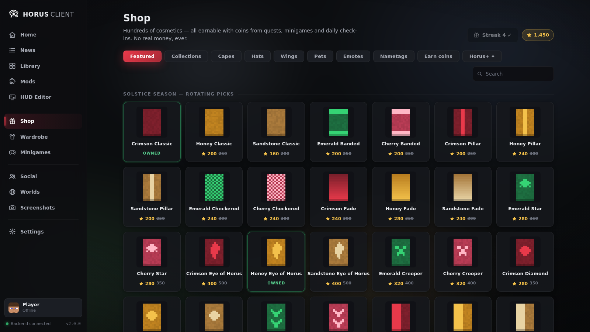
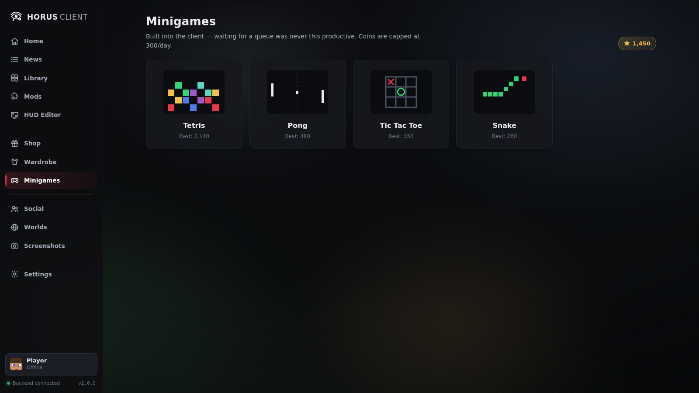
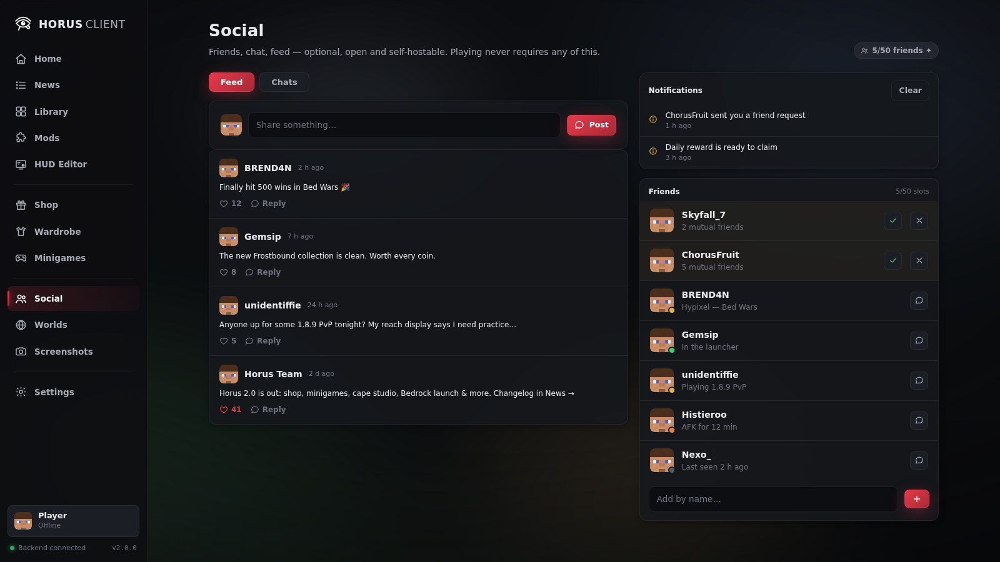
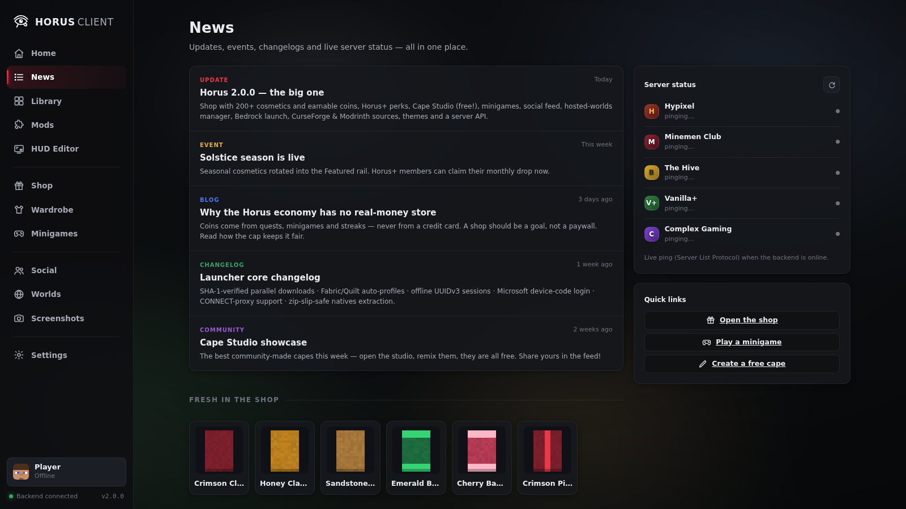

<div align="center">

# 𓂀 Horus Client

**The open Minecraft client-launcher.**
Feather's polish + NoRisk's features — rebuilt as free software, with the paywalls designed out.

MIT licensed · zero dependencies · no telemetry · no real-money store · no account required

[Deutsch 🇩🇪](README.de.md) · [Quick start](#quick-start-windows) · [Features](#everything-inside) · [Economy](#the-coin-economy-no-credit-card-anywhere) · [Architecture](#architecture)


</div>

---

## Everything inside

| | |
|---|---|
| 🛒 **Cosmetic shop** | **200+ items**: capes, hats, wings, **pets**, emotes and **nametag effects**. Seasonal rotations, **collections** (matching sets with bundle discounts), 3D **try-on before you buy** — and everything is bought with **coins you earn in-app**, never with money. |
| 🪙 **Coins & quests** | Daily check-in with streak bonuses, daily/weekly/one-time quests, minigame payouts (capped per day so it stays a game). |
| ✦ **Horus+** | The NRC+-style tier — paid **with coins**: monthly cosmetic drop, 20 % shop discount, 50 friend slots, 5 hosted worlds, animated nametags, exclusives. A goal, not a paywall. |
| 🎨 **Cape Studio** | Design your own capes **for free**: 10×16 pixel editor with fill/mirror tools, PNG import/export, instant equip. |
| 🕹️ **Minigames** | Tetris, Pong (vs AI), Tic-Tac-Toe, Snake — built into the client, high scores feed quests and coins. |
| 💬 **Social** | Friend **requests**, online status, per-friend **chats**, a **social feed** with posts & likes, notifications — optional, self-hostable, never required to play. |
| 🌍 **Hosted Worlds** | Your real saves from every profile, host/invite flow wired into the social layer, slot limits raised by Horus+. |
| 📰 **News** | Updates, events, changelog, fresh cosmetics — plus **live server status** via a real Server-List-Ping implementation. |
| 🎛️ **Mod menu & HUD editor** | 40+ built-in modules (Keystrokes, CPS, Zoom, Scoreboard, …) in the Feather-style grid, plus drag-anywhere HUD overlays. |
| ⬇️ **Real launcher core** | All Minecraft versions from Mojang's official metadata, SHA-1-verified parallel downloads, **Fabric/Quilt** auto-profiles, per-profile isolation. |
| 🧩 **CurseForge + Modrinth** | Both mod sources built in. Modrinth works out of the box; CurseForge takes your free API key. Plain jars in the standard `mods/` folder. |
| 🔑 **Microsoft login** | Full device-code chain (MSA → Xbox Live → XSTS → Minecraft services) with your own Azure client ID — plus first-class offline sessions. |
| 🟫 **Bedrock Edition** | A Bedrock profile type launches the Store version via `minecraft://` on Windows. |
| 🎨 **Themes** | Dark, Midnight, Sandstone, Light + free accent color. |
| 🔌 **Server API** | Open overlay/payload API for servers ([docs/server-api.md](docs/server-api.md)) — inspect every byte. |

<div align="center">
 
 
 
</div>

## Quick start (Windows)

1. Install Node.js once: `winget install OpenJS.NodeJS.LTS` (and Java for playing: `winget install EclipseAdoptium.Temurin.21.JRE`)
2. [Download this repository](https://github.com/Han4Star2/MinecraftClient/archive/refs/heads/main.zip) and unzip it
3. **Double-click `Horus.bat`** — the backend starts and Horus opens as its own app window (Edge `--app` mode, no browser chrome)

No `npm install`, no build step — Horus has **zero dependencies**.

<details>
<summary>Linux / macOS / manual start</summary>

```bash
git clone https://github.com/Han4Star2/MinecraftClient
cd MinecraftClient
npm start            # = node server/index.js → http://127.0.0.1:7411

node server/index.js --portable   # keep all data in ./data
node server/index.js --data <dir> --port 7411 --no-open
```
</details>

```bash
npm test             # zip reader, rules engine, API+economy, offline dry-run launch e2e
npm run screenshots  # regenerate docs/screenshots via headless Chromium
```

### Signing in with Microsoft

Settings → Account → session type `msa`. Horus implements the standard
device-code flow; being open source it ships **no embedded secrets**, so you
paste an Azure *application (client) ID* once:
[portal.azure.com](https://portal.azure.com) → App registrations → New →
account type “personal Microsoft accounts”, enable *Allow public client flows*.
Takes ~3 minutes, free, and the token never leaves your machine
(`msa-session.json`, chmod 600). Offline mode works without any of this.

### Mods

Pick a profile (e.g. Fabric + 1.21.5), open **Mods → Get more mods** and
install from **Modrinth** (no key) or **CurseForge** (free key in Settings →
Network). Everything lands as plain jars in the profile's standard `mods/`
folder — `.jar` ⇄ `.jar.disabled` toggling, metadata read from
`fabric.mod.json`/`mcmod.info`. Forge/NeoForge automation is on the roadmap;
existing installations keep working through the shared game directory.

### Bedrock

Create a profile with loader **Bedrock Edition** — launching hands off to the
Microsoft-Store app via `minecraft://` (Windows). Switching between Bedrock
*versions* requires appx sideloading, which Store apps don't allow a launcher
to automate cleanly; pair Horus with a dedicated version switcher for that —
honestly documented instead of half-working.

## The coin economy (no credit card, anywhere)

```
daily check-in (streak bonus) ─┐
quests (daily/weekly/once)  ───┼──► coins ──► shop items · collections · Horus+
minigames (≤300/day)        ───┘
```

Prices, quests and drop rates are plain data in
[`app/js/shopCatalog.js`](app/js/shopCatalog.js). The backend persists the
economy as JSON (`economy.json`) — it's *your* save file: back it up, edit it,
it's yours. Custom capes from the studio are always free and never counted
against anything.

## NoRisk/Feather feature parity — and what Horus fixes

| Elsewhere | In Horus |
|---|---|
| Cosmetics cost real money | Coins are **earned in-app only** — there is no payment path in the codebase |
| Premium tier costs €/month | Horus+ costs **coins** and is otherwise identical in spirit (monthly drops, discounts, bigger limits) |
| Proprietary client, closed shop backend | MIT-licensed, local-first: shop catalog, economy and cosmetics are open data on your disk |
| Cosmetics tied to their account servers | Rendered locally; visible to anyone on Horus; custom capes exportable as PNG |
| Social layer tied to vendor infra | Local-first demo today, open protocol + self-hostable relay documented ([docs/server-api.md](docs/server-api.md)) |
| Electron-class footprint | Zero-dependency Node core + vanilla-JS UI (~90 KB), runs in the webview you already have |
| Account required | Offline sessions built in; Microsoft login optional |
| Telemetry | None. There is no analytics code to turn off. |

## Architecture

```
┌──────────────────────────────────────────────────────────────┐
│  app/          vanilla JS + CSS, no build step                │
│  ├─ pages/     home news library mods hud shop wardrobe       │
│  │             minigames social worlds screenshots settings   │
│  └─ js/        router · i18n EN/DE · SSE client · demo mode   │
│                economy · 200+ item catalog · CSS-3D player    │
│                (skins, capes, hats, wings, pets, nametags)    │
├────────────────────────── HTTP + SSE ────────────────────────┤
│  server/       Node ≥18, zero npm dependencies                │
│  ├─ launcher   rules engine · args (modern+legacy) · natives  │
│  │             process supervisor · Bedrock hand-off          │
│  ├─ meta       Mojang manifest (cached, mirrorable) ·         │
│  │             Fabric/Quilt profile merge                     │
│  ├─ downloads  parallel queue · SHA-1 verify · resume-skip    │
│  ├─ zip        minimal reader (natives, mod metadata)         │
│  ├─ net        redirects · timeouts · CONNECT proxy           │
│  ├─ msa        device-code chain (MSA→XBL→XSTS→MC)            │
│  ├─ ping       Server List Ping (news page live status)       │
│  ├─ modrinth / curseforge   two mod sources, plain jars       │
│  └─ store      settings/profiles/economy as plain JSON        │
└──────────────────────────────────────────────────────────────┘
```

Data lives in `~/.horus` (or `./data` with `--portable`): open JSON for
settings, profiles and economy; shared hash-verified `libraries/`, `versions/`,
`assets/`; isolated per-profile game dirs. Previously used versions launch
offline from cache; the bundled fallback version list is clearly marked and
never fakes hashes.

## Testing

`npm test` (dependency-free `node:test`): ZIP round-trip vs an independent
writer incl. zip-slip protection · rules engine · maven mapping · loader
merge · offline UUID · API smoke test incl. **economy persistence** · full
**dry-run launch** against a local fixture meta server, hash-verified end to
end. The UI is additionally exercised by a Playwright interaction suite
(22 steps: buy→equip flow, cape studio, minigames, social, themes, overlay
API) — zero console errors.

## Roadmap

Forge/NeoForge installer automation · companion mod with the `horus:api`
plugin channel · self-hosted social relay · skin upload · Bedrock version
switching via sideload tooling · signed release bundles.

## License

[MIT](LICENSE). Not affiliated with Mojang, Microsoft, Feather or NoRisk.
“Minecraft” is a trademark of Mojang Synergies AB. Horus launches the game you
own through official metadata and never redistributes game files.
