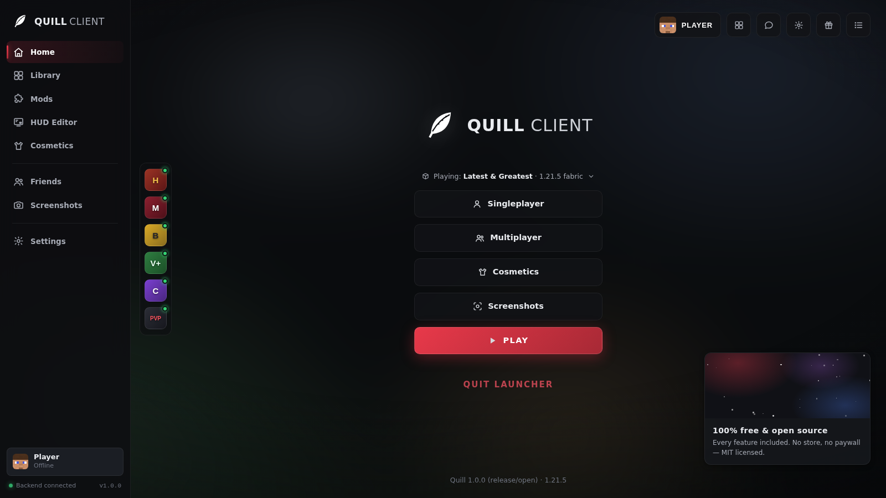
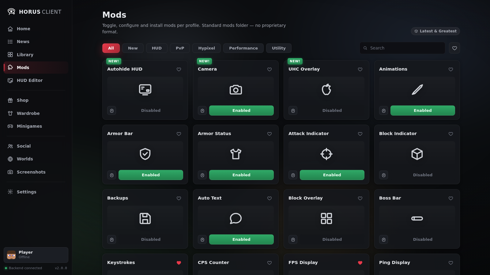
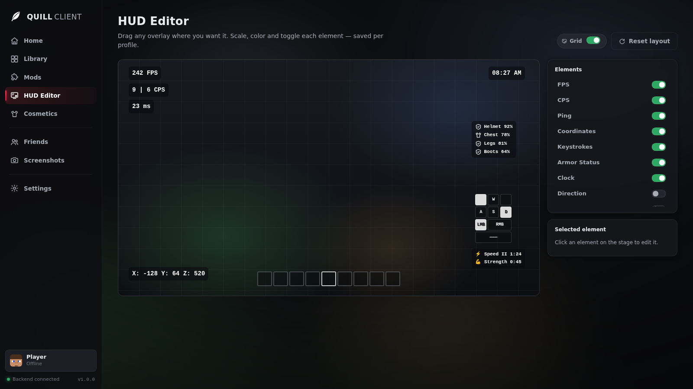
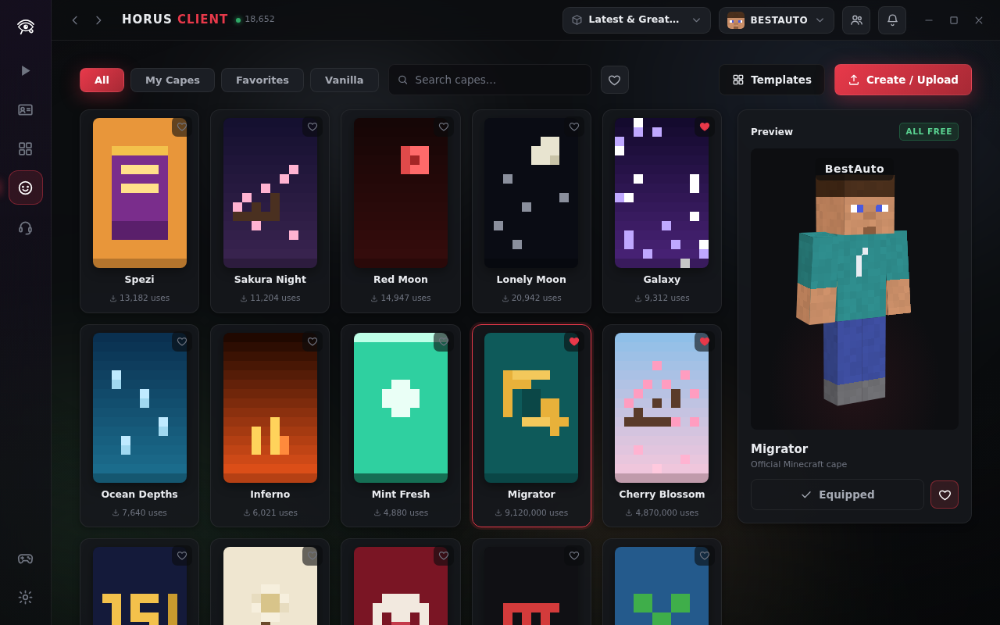
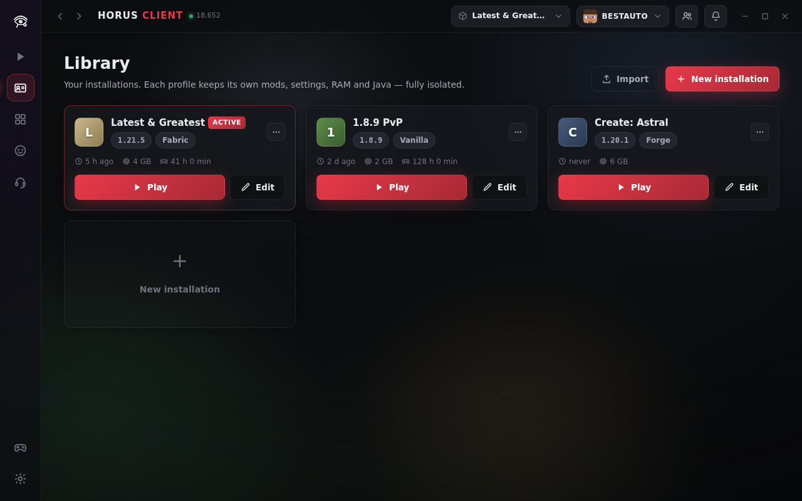

<div align="center">

# 🪶 Quill Launcher

**An open, feather-light Minecraft launcher.**
The Feather Client experience — rebuilt from scratch, with its weaknesses fixed.

MIT licensed · zero dependencies · no telemetry · no account required

[Deutsch 🇩🇪](README.de.md) · [Quick start](#quick-start) · [Fixed weaknesses](#feather-weaknesses--how-quill-fixes-them) · [Architecture](#architecture)



</div>

---

## What is this?

Quill recreates what makes Feather-style clients great — the modern dark UI, the
mod menu, the HUD editor, cosmetics, profiles — as **fully open software**, and
deliberately repairs the pain points of the original:

| | |
|---|---|
| 🎛️ **Mod menu** | Feather-style card grid: toggle, favorite and configure 40+ built-in modules (Keystrokes, CPS, Zoom, Toggle Sprint, Scoreboard, …) with real settings dialogs |
| 🖥️ **HUD editor** | Drag any overlay anywhere, center snapping, per-element scale/color/opacity/background, live preview values |
| 🧢 **Cosmetics** | Capes, hats, wings, bandanas, backpacks, emotes — rendered on a CSS-3D voxel player. **Everything is free.** |
| 📚 **Library** | Unlimited installations, each fully isolated: own mods folder, RAM, Java, JVM args, game dir. JSON import/export |
| ⬇️ **Real launcher core** | Mojang version metadata, SHA-1-verified parallel downloads, natives extraction, Fabric/Quilt profile merging, offline + Microsoft auth, live log console |
| 🔌 **Modrinth built in** | Search and install plain jars into the standard `mods/` folder — the same files every other launcher understands |

<div align="center">
 
 
</div>

## Quick start

Requirements: **Node.js ≥ 18** (and a Java runtime to actually start the game).

```bash
git clone https://github.com/Han4Star2/MinecraftClient
cd MinecraftClient
npm start          # = node server/index.js — opens http://127.0.0.1:7411
```

That's it. No `npm install` — Quill has **zero dependencies**.

Useful flags:

```text
node server/index.js
  --port 7411      # UI/API port (localhost-bound)
  --portable       # keep all data in ./data instead of ~/.quill
  --data <dir>     # explicit data directory
  --no-open        # don't open the browser
```

The UI also runs without the backend (open `app/index.html` from any static
host): it switches to **demo mode** with local persistence, so you can explore
every screen — the sidebar badge tells you which mode you're in.

```bash
npm test           # zip reader, rules engine, API, offline dry-run launch e2e
npm run screenshots  # regenerate docs/screenshots via headless Chromium
```

## Feather weaknesses → how Quill fixes them

| Feather weakness | Quill's fix |
|---|---|
| **Proprietary** — source not fully open | Everything here is MIT. Audit it, fork it, ship it. No blobs, no obfuscation, no phone-home. |
| **Paid cosmetics** | Every cape/hat/wing is free, defined as open data (`app/js/catalog.js`), rendered locally. There is no store to sell you anything. |
| **Heavy launcher** (Electron-class RAM/CPU) | Zero-dependency Node core (~35 MB RSS) + a vanilla-JS UI (~60 KB, no build step) in the browser/webview you already have. Animations are pure CSS, respect `prefers-reduced-motion`, and can be disabled entirely in Settings. |
| **Ecosystem lock-in** | Open JSON everywhere: profiles export/import as plain files, the game dir speaks the vanilla `.minecraft` layout (point Quill at an existing one and it just works), the meta server is a **configurable mirror** (Settings → Network), and the social layer is optional & self-hostable. |
| **Big modpacks fragile** | No proprietary mod format: standard `mods/` folder with `.jar`/`.jar.disabled` toggling, real loader metadata (Fabric/Quilt profile JSONs merged exactly like the official spec), per-profile isolation so packs can't stomp each other, Modrinth installs plain jars. |
| **Account required to use it** | Offline sessions are first-class (UUIDv3, works in singleplayer & offline-mode servers). Microsoft sign-in is optional, implemented as the standard device-code flow with **your own** Azure client ID — open source ships no secrets. |
| *(bonus)* Telemetry | None. There is no analytics code to turn off. |

## Architecture

```
┌─────────────────────────────────────────────────────────────┐
│  app/            vanilla JS + CSS, no build step             │
│  ├─ pages/       home · library · mods · hud · cosmetics ·   │
│  │               friends · screenshots · settings            │
│  └─ js/          hash router · i18n (EN/DE) · SSE client ·   │
│                  demo-mode fallback · CSS-3D skin renderer   │
├──────────────────────── HTTP + SSE ─────────────────────────┤
│  server/         Node ≥18, zero npm dependencies             │
│  ├─ index.js     static hosting · REST API · CLI flags       │
│  ├─ launcher.js  rules engine · arg builder (modern+legacy)  │
│  │               process supervisor · playtime tracking      │
│  ├─ meta.js      Mojang manifest + version JSON (cached,     │
│  │               mirrorable) · Fabric/Quilt profile merge    │
│  ├─ downloads.js parallel queue, SHA-1 verify, resume-skip   │
│  ├─ zip.js       minimal ZIP reader (natives, mod metadata)  │
│  ├─ net.js       HTTP client: redirects, timeouts, CONNECT   │
│  │               proxy support, loopback bypass              │
│  ├─ msa.js       device-code auth chain (MSA→XBL→XSTS→MC)    │
│  ├─ mods.js      standard mods/ folder manager               │
│  ├─ modrinth.js  search + install plain jars                 │
│  └─ store.js     settings/profiles as plain JSON             │
└─────────────────────────────────────────────────────────────┘
```

**Data locations** — `~/.quill` by default, `./data` with `--portable`:
`settings.json`, `profiles.json`, `libraries/`, `versions/`, `assets/`
(shared, hash-verified, reused across profiles), `profiles/<id>/` (isolated
game dirs with their own `mods/`).

**Offline behaviour** — previously used versions launch from cache; the
version picker falls back to a bundled list (clearly marked, no fake hashes);
errors say exactly what needs one online fetch. Downloads resume by skipping
files whose SHA-1 already matches.

### API surface (localhost)

`GET /api/status · /api/settings · /api/profiles · /api/versions · /api/javas ·
/api/profiles/:id/mods · /api/modrinth/search · /api/events (SSE)` —
`PUT /api/settings · /api/profiles/:id` —
`POST /api/launch · /api/launch/cancel · /api/launch/kill ·
/api/profiles/:id/mods/toggle|delete · /api/modrinth/install ·
/api/msa/start · /api/cache/clear · /api/quit`

Everything the UI does, you can script.

## Testing

`npm test` runs a dependency-free `node:test` suite:

- **ZIP reader** round-trips against an independently implemented writer,
  including zip-slip protection and mod-metadata extraction,
- **rules engine**, maven-coordinate mapping, loader-profile merging,
  offline-UUID stability,
- **API smoke test** against a real server process in a temp data dir,
- **full dry-run launch** against a local fixture meta server: manifest →
  version JSON → hash-verified downloads → natives extraction → final java
  command, asserted end to end, fully offline.

## Roadmap

- Forge/NeoForge installer automation (today: honest error + shared-game-dir
  interop with existing installations)
- Skin upload / fetching skins by name when online
- Self-hostable friends relay (protocol sketch in `app/js/pages/friends.js`)
- Prebuilt `.deb`/`.msi`/`.dmg` wrappers around a system webview

## License

[MIT](LICENSE). Not affiliated with Mojang, Microsoft or Feather — “Minecraft”
is a trademark of Mojang Synergies AB. Quill launches the game you own through
official metadata and never redistributes game files.
